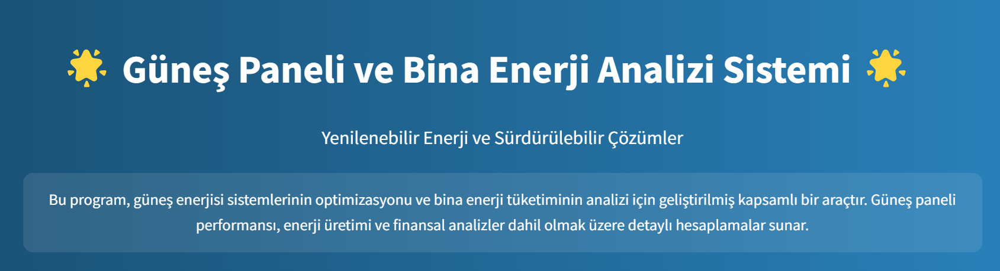
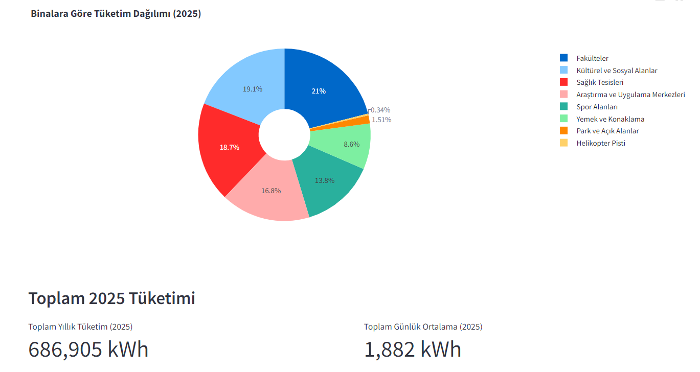
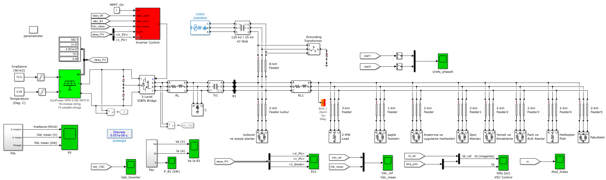

# 🌟 Güneş Enerjisi Sistemleri Analiz ve Optimizasyon Platformu

<div align="center">
  
  <h3>ESOGÜ Kampüs Enerji Optimizasyonu ve Analiz Sistemi</h3>
</div>

## 🎯 Proje Vizyonu

Bu platform, **Eskişehir Osmangazi Üniversitesi** kampüsünün enerji ihtiyaçlarını optimize etmek ve yenilenebilir enerji kullanımını maksimize etmek için geliştirilmiş kapsamlı bir analiz sistemidir.

## 🖥️ Demo Uygulama

Projenin canlı demo uygulamasına [buradan](https://mertdisturbution.streamlit.app/) ulaşabilirsiniz.

### Temel Hedefler:
- 🏛️ **Kampüs Enerji Bağımsızlığı:** Elektrik ihtiyacının öz kaynaklardan karşılanması
- 💰 **Ekonomik Sürdürülebilirlik:** Fazla enerjinin şebekeye satışı
- 🌱 **Çevresel Etki:** CO₂ emisyonlarının minimize edilmesi
- 📚 **Akademik Katkı:** AR-GE ve eğitim faaliyetlerinin desteklenmesi

## 🔧 Teknik Altyapı

### 1. Donanım Bileşenleri
- **Güneş Panelleri:** SunPower SPR-415E-WHT-D (415W)
- **String Konfigürasyonu:** 74 paralel string
- **İnvertör:** 3-Seviyeli IGBT Köprüsü
- **Transformatör:** 120 kV / 25 kV, 47 MVA

### 2. Yazılım Sistemleri
- **Analiz Platformu:** Python + Streamlit
- **Simülasyon:** MATLAB/Simulink
- **Veri Analizi:** Pandas, NumPy, Scikit-learn
- **Görselleştirme:** Plotly, Matplotlib

## 📊 Analiz Modülleri

### 1. Güneş Paneli Analizi
- Panel açısı optimizasyonu
- Gölgelenme analizi
- Sıcaklık etkisi hesaplamaları
- Verimlilik analizi
- Işınım hesaplamaları

### 2. Bina Enerji Tüketimi
- Saatlik/günlük/aylık tüketim analizi
- Yük profili çıkarma
- Kompanzasyon hesaplamaları
- Enerji tasarruf önerileri

### 3. Forecast Sonuçları
<div align="center">
  
</div>

- Yapay zeka tabanlı üretim tahminleri
- SARIMAX modeli ile zaman serisi analizleri
- Mevsimsel etki hesaplamaları
- 2025 yılı projeksiyon tahminleri

### 4. Simulink Entegrasyonu
<div align="center">
  
</div>

- MATLAB/Simulink model karşılaştırması
- Gerçek verilerle simülasyon
- Python-Simulink veri senkronizasyonu
- %5'in altında hata oranı

## 💰 Finansal Analiz

- **Toplam Yatırım:** 47.5 Milyon TL
- **Yıllık İşletme Gideri:** 250 Bin TL
- **Geri Ödeme Süresi:** 5.2 Yıl
- **Yıllık Enerji Üretimi:** 2.4 GWh

## ⚙️ Kurulum

1. Gerekli paketleri yükleyin:
```
pip install -r requirements.txt
```
## 📊 Kullanım Kılavuzu

1. **Güneş Paneli Analizi**
   - Panel özelliklerini girin
   - Lokasyon bilgilerini seçin
   - Analiz sonuçlarını inceleyin

2. **Bina Analizi**
   - Tüketim verilerini yükleyin
   - Bina tipini seçin
   - Optimizasyon önerilerini görüntüleyin

3. **Tahmin Analizi**
   - Veri aralığını seçin
   - Model parametrelerini ayarlayın
   - Tahmin sonuçlarını görüntüleyin

## 👨‍💻 Geliştirici

**Muhammet Mert Kuş**
- 🎓 Elektrik ve Elektronik Mühendisi
- 🏫 Eskişehir Osmangazi Üniversitesi
- 📧 muhammetmertkus@gmail.com
- 🔗 [LinkedIn](https://www.linkedin.com/in/muhammet-mert-ku%C5%9F-278247184/)
- 🔗 [GitHub](https://github.com/muhammetmertkus)


## 📝 Lisans

Bu proje MIT lisansı altında lisanslanmıştır.

---

<div align="center">
  <p>🌟 Sürdürülebilir Kampüs için Akıllı Çözümler 🌟</p>
</div>
